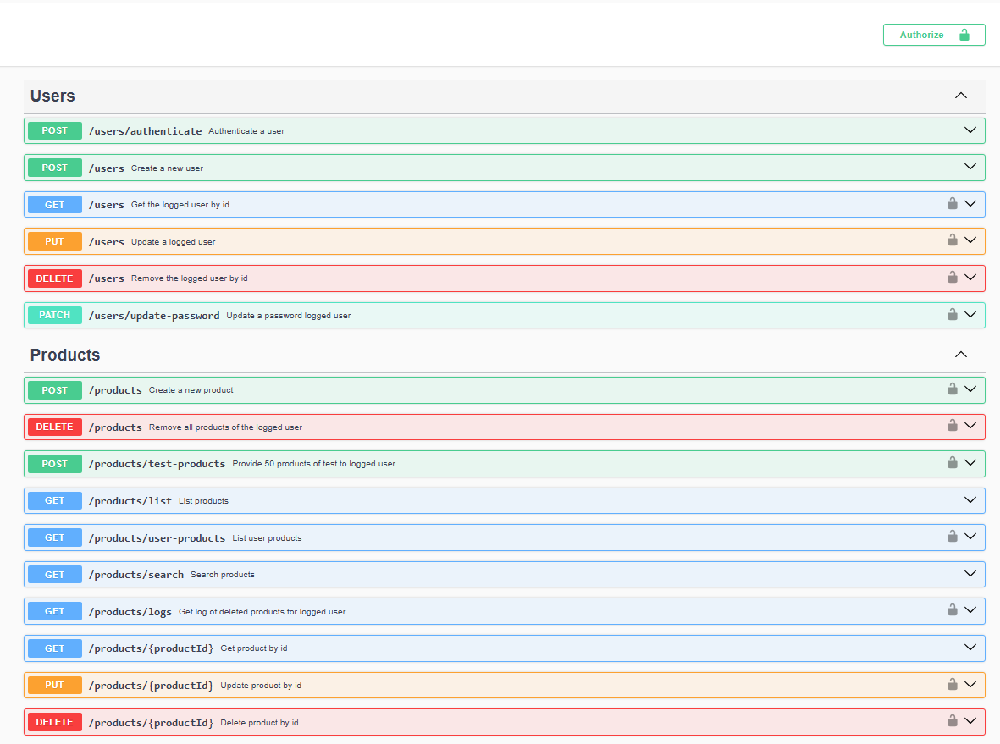

<h1 align="center"><strong>Products by Users API</strong></h1>

## **About**
User and product registration API.

---

## 🗂️ **Downloading the project**

<br>

```bash
# Clone this repository with the command
$ git clone https://github.com/rafaelsgomes/lexartlabs-backend-challenge

# Access the project directory
$ cd lexartlabs-backend-challenge

# Install dependencies with the command
$ npm install
# or
$ yarn
# or
$ pnpm i

# You must create the .env file with the correct environment variables

# The server will be available on port:3000 visit: http://localhost:3000
```

---

## 💻 **Using the API**

When accessing the route `http://localhost:3000/api-docs` you will be redirected to the documentation page created by swagger-ui-express, where it will be possible to test the application.

<h3 align="center" >
    
</h3>

---
> <p>Made with ❤️ by Rafael Gomes <a href="https://www.linkedin.com/in/rafaelsgomes/">See my LinkedIn</a></p>